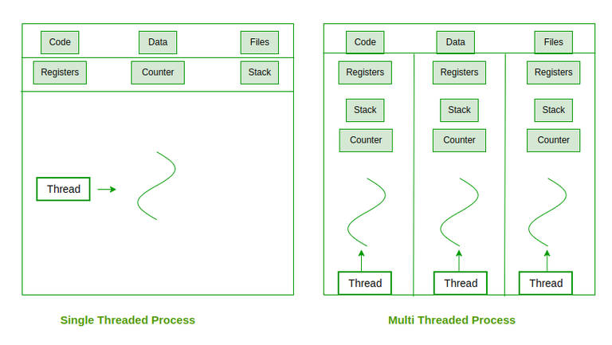
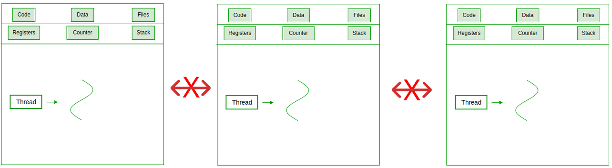
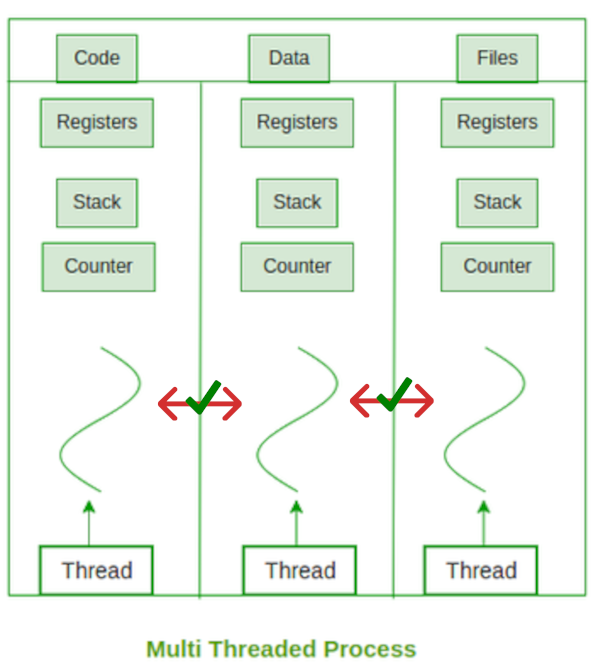
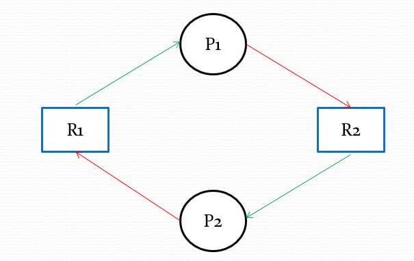

# Philosophers
42 project for learning algorithms and synchronization problems

## Procesos e hilos

### ¿Qué es un hilo?

Un hilo se trata de la unidad de ejecución más pequeña dentro de un proceso. Es decir, cuando lanzamos un hilo en nuestro código estamos diciendole a nuestro programa que realize una serie de acciones de manera "simultanea" a nuestro proceso principal, lo que nos permite llamar a otras funciones dentro del orden de ejecución de nuestro programa. Para resumir, si pensamos en la ejecución normal de nuestro programa como el hilo principal, el uso de multiples hilos nos permite ejecutar otras funciones a la par.



Sin embargo, no hay que dejarse engañar. Los hilos normalmente no se ejecutan totalmente en paralelo de manera real, si no que que se ejecutan concurrentemente, alternando rápidamente entre ellos para que de la sensación de que se están ejecutando de manera paralela e independiente. Para que se puedan ejecutar de manera paralela de forma real, es necesario que la CPU cuente con varios nucleos. Sólo así se puede asegurar que los hilos se ejecutan de manera paralela y no haya conflictos (spoiler, este proyecto trata de solventar estos conflictos).

Para crear un proceso, podemos usar la librería `pthread.h` y la función `pthread_create`.

```c
#include <pthread.h>

pthread_t*;

int pthread_create(
    pthread_t *thread,
    const pthread_attr_t *attr,
    void *(*start_routine) (void *),
    void *arg);
```

Para manejar `pthread`, primero necesitamos una estructura `pthread_t` que aloje la información sobre nuestro hilo, como su id. `pthread_create` es el encargado de crear un nuevo hilo, darle una id y ejecutar una función (llamada routine) en concreto. En error, `pthread_create` devuelve una flag con el error, lo que se puede usar como mecanismo de control.

<details>
<summary>🔍 Ejemplo de código</summary>

```c
#include <pthread.h>
#include <unistd.h>

void* routine() {
    printf("Hello from threads\n");
    sleep(3);
    printf("Ending thread\n");
}

int main(int argc, char* argv[]) {
    pthread_t p1;
    pthread_t p2;

    if (pthread_create(&p1, NULL, &routine, NULL) != 0)
        return 1;
    if (pthread_create(&p2, NULL, &routine, NULL) != 0)
        return 2;
    return 0;
}
```
</details>

Pero al igual que con `fork`, tenemos que indicarle al proceso que espere a que estos hilos terminen de ejecutarse antes de acabar la ejecución del programa, si no puede que se queden con tareas pendientes por hacer. Para ello utilizamos `pthread_join` (muy parecida a `wait`).  Al igual que `pthread_create`, devuelve flag en caso de error, lo que podemos usar como mecanismo de control.

```c
#include <pthread.h>

int pthread_join(
    pthread_t thread,
    void **retval);
```

<details>
<summary>🔍 Ejemplo de código</summary>

```c
#include <pthread.h>
#include <unistd.h>

void* routine() {
    printf("Hello from threads\n");
    sleep(3);
    printf("Ending thread\n");
}

int main(int argc, char* argv[]) {
    pthread_t p1;
    pthread_t p2;

    if (pthread_create(&p1, NULL, &routine, NULL) != 0)
        return 1;
    if (pthread_create(&p2, NULL, &routine, NULL) != 0)
        return 2;
	if (pthread_join(p1, NULL) != 0)
        return 3;
    if (pthread_join(p2, NULL) != 0)
        return 4;
    return 0;
}
```
</details>

### ¿En qué se diferencia de un proceso?

Cada proceso tiene asociados una serie de recursos asignados, como puede ser el stack o su registro, pero también otros elementos como las señales o el acceso a diferentes archivos y sus descriptores. Por ejemplo, usando varios procesos usando `fork`, si desde un proceso abrimos un file descriptor, no podremos acceder a él desde otro proceso. O si cambiamos una variable, su valor sólo se modificará dentro de ese mismo proceso, no afectará al conjunto del programa. Es decir, que una vez creados los procesos no comparten los mismos recursos entre entre ellos, si no que el sistema aloja unos nuevos recursos para cada proceso de manera individual.



Por el contrario, los hilos nacen de un mismo proceso, por lo que sí que comparten recursos y memoria. Esto los hace mucho más ligeros (no hay que destinar recursos nuevos) y hace más sencilla la comunicación entre ellos. Esto hace que si un hilo abre un file descriptor o accede a una variable, estos cambios afectan al resto de hilos, por lo que los cambios afectan al conjunto de hilos. Esto los hace mucho más eficientes para según que tareas.



En resumen, dependiendo del contexto es más útil utilizar uno u otro teniendo en cuenta sus diferencias.

| **Característica**  | **Proceso**                       | **Hilo**                             |
|---------------------|-----------------------------------|---------------------------------------|
| **Memoria**         | Aislada (independiente)           | Compartida con su proceso             |
| **Velocidad**       | Más lento (mayor sobrecarga)      | Más rápido (menos sobrecarga)         |
| **Comunicación**    | Más compleja (IPC)                | Más sencilla (memoria compartida)     |
| **Fallos**          | No afecta a otros procesos        | Puede afectar a otros hilos del proceso |
| **Uso**             | Programas independientes          | Tareas simultáneas dentro de un programa |

### ¿Qué son las Race Conditions y como gestionarlas?

Que los threads compartan recursos es una ventaja... pero también puede suponer un problema si dos hilos quieren acceder al mismo recurso a la vez. Esto es lo que se conoce como Race Conditions: cuando varios hilos intentan acceder al mismo recurso a la vez y se tienen que decidir las condiciones y el orden en el que los hilos van a acceder a este recurso. La mala gestión de estas condiciones puede llevbaar a que sólo un hilo llegue a acceder a uno de estos recursos y nunca lo suelte, por lo que el resto de hilos se quedarán esperando hasta que esté liberado (osease, hasta el infinito).

Esto se conoce como **Deadlock**, y es uno de los problemas más recurrentes a la hora de utilizar varios hilos.



Para establecer en qué orden los hilos van a acceder a los diferentes recursos del proceso, tenemos que usar `mutex`. `mutex` actua como una especie de semaforo que es capaz de evitar que un hilo acceda a una función mientras otro hilo la esté ejecutando, una protección frente a otros threads.

Para usarla, tenemos que iniciar una estructura `pthread_mutex_t`, iniciarlaza con `pthread_mutex_init` y elegir en qué rango del código queremos implementarla con `pthread_mutex_lock` y `pthread_mutex_unlock`. Por supuesto, esta estructura también se tiene que liberar con `pthread_mutex_destroy`.

```c
pthread_mutex_t your_mutex;

int pthread_mutex_init(
    pthread_mutex_t *mutex,
    const pthread_mutexattr_t *attr);

int pthread_mutex_lock(
    pthread_mutex_t *mutex);

int pthread_mutex_unlock(
    pthread_mutex_t *mutex);

int pthread_mutex_destroy(
    pthread_mutex_t *mutex);
```

<details>
<summary>🔍 Ejemplo de código</summary>

```c
#include <stdlib.h>
#include <stdio.h>
#include <pthread.h>

int mails = 0;
pthread_mutex_t mutex; // Struct for mutex

void* routine() {
    for (int i = 0; i < 10000000; i++) {
        pthread_mutex_lock(&mutex); // Start of the area we want to protect
        mails++;
        pthread_mutex_unlock(&mutex); // End of mutex
    }
}

int main(int argc, char* argv[]) {
    pthread_t p1, p2, p3, p4;
    pthread_mutex_init(&mutex, NULL); // We init mutex in main
    if (pthread_create(&p1, NULL, &routine, NULL) != 0) {
        return 1;
    }
    if (pthread_create(&p2, NULL, &routine, NULL) != 0) {
        return 2;
    }
    if (pthread_create(&p3, NULL, &routine, NULL) != 0) {
        return 3;
    }
    if (pthread_create(&p4, NULL, &routine, NULL) != 0) {
        return 4;
    }
    if (pthread_join(p1, NULL) != 0) {
        return 5;
    }
    if (pthread_join(p2, NULL) != 0) {
        return 6;
    }
    if (pthread_join(p3, NULL) != 0) {
        return 7;
    }
    if (pthread_join(p4, NULL) != 0) {
        return 8;
    }
    pthread_mutex_destroy(&mutex); // We free our mutex struct
    printf("Number of mails: %d\n", mails);
    return 0;
}
```
</details>

## Videos y bibliografía

### Vídeos
- [Unix Threads in C (lista de reproducción, empieza por aquí)](https://www.youtube.com/watch?v=d9s_d28yJq0&list=PLfqABt5AS4FmuQf70psXrsMLEDQXNkLq2)
- [The Dining Philosophers Problem](https://www.youtube.com/watch?v=FYUi-u7UWgw)
- [The dining Philosophers in C: threads, race conditions and deadlocks #codewithme](https://www.youtube.com/watch?v=zOpzGHwJ3MU)

### Artículos
- [Philosophers 42 Guide— “The Dining Philosophers Problem”](https://medium.com/@ruinadd/philosophers-42-guide-the-dining-philosophers-problem-893a24bc0fe2)
- [Philosophers 42 Guide](https://42-cursus.gitbook.io/guide/rank-03/philosophers)
- [Philosophers — Dining Philosophers problem. 42 project guide — Mandatory part](https://medium.com/@denaelgammal/dining-philosophers-problem-42-project-guide-mandatory-part-a20fb8dc530e)
