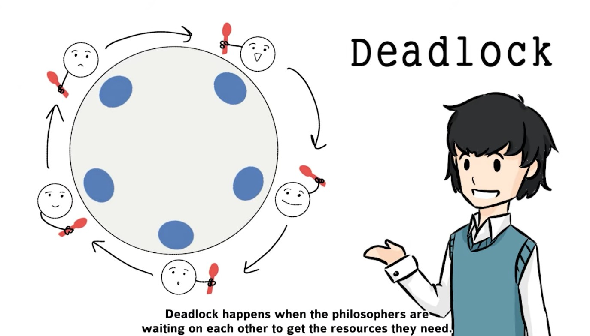

# Philosophers
42 project for learning algorithms and synchronization problems

* 1. [Paralelismo vs Concurrencia](#ParalelismovsConcurrencia)
* 2. [Procesos e hilos](#Procesosehilos)
	* 2.1. [¿Qué es un hilo?](#Quesunhilo)
	* 2.2. [¿En qué se diferencia un hilo de un proceso?](#Enqusediferenciaunhilodeunproceso)
	* 2.3. [Obtener el valor de retorno de un hilo](#Obtenerelvalorderetornodeunhilo)
	* 2.4. [Cómo pasar argumentos a un hilo](#Cmopasarargumentosaunhilo)
	* 2.5. [Manejando varios hilos: qué son las Race Conditions y cómo gestionar recursos con Mutex](#Manejandovarioshilos:qusonlasRaceConditionsycmogestionarrecursosconMutex)
	* 2.6. [Separar hilos y optimizar recursos](#Separarhilosyoptimizarrecursos)
* 3. [Notas y consejos](#Notasyconsejos)
* 4. [Videos y bibliografía](#Videosybibliografa)
	* 4.1. [Vídeos](#Vdeos)
	* 4.2. [Artículos](#Artculos)
	* 4.3. [Recursos](#Recursos)

##  1. <a name='ParalelismovsConcurrencia'></a>Paralelismo vs Concurrencia

Lo primero de todo, el problema de los filosofos explicado por una de mis series favoritas, [Pantheon](https://www.netflix.com/es-en/title/81937398) (hazte un favor, haz click en la imagen y miratela).

[](https://www.youtube.com/watch?v=V0_PU7GEJPg)

Antes de hablar sobre hilos y procesos, tenemos que explicar la diferencia entre dos conceptos: el paralelismo y la concurrencia. Aunque son muy parecidos, hay algunas diferencias cruciales, sobre todo en la gestión de recursos.

* Paralelismo: varios procesos / hilos se ejecutan de manera totalmente paralela. Cada uno tiene sus propios recursos, por lo que no hay conflictos en la gestión de los mismos. Cada proceso / hilo puede operar de forma totalmente independiente.

* Concurrencia: varios procesos / hilos se ejecutan compartiendo los mismos recursos. Esto puede dar un conflicto de los mismos si dos procesos / hilos itnenta usar el mismo recurso (archivo, variable...) a la vez. Es necesario gestionar el orden y el uso de estos recursos.

Para que te hagas una idea, es como si en una oficina se organizan en dos filas para comprar un refresco. En el paralelismo, hay dos maquinas, por lo que cada fila avanza de forma independiente y no hay problemas para gestionar los recursos.

Pero en la concurrencia, aún habiendo dos filas, hay sólo una máquina. Por lo que cada fila se tiene que poner de acuerdo en el orden en el que van usando la misma máquina.


##  2. <a name='Procesosehilos'></a>Procesos e hilos

###  2.1. <a name='Quesunhilo'></a>¿Qué es un hilo?

Un hilo se trata de la unidad de ejecución más pequeña dentro de un proceso. Es decir, cuando lanzamos un hilo en nuestro código estamos diciendole a nuestro programa que realize una serie de acciones de manera "simultanea" a nuestro proceso principal, lo que nos permite llamar a otras funciones dentro del orden de ejecución de nuestro programa. Para resumir, si pensamos en la ejecución normal de nuestro programa como el hilo principal, el uso de multiples hilos nos permite ejecutar otras funciones a la par.


Sin embargo, no hay que dejarse engañar. Los hilos normalmente no se ejecutan totalmente en paralelo de manera real, si no que se van alternando rápidamente entre ellos para que de la sensación de que se están ejecutando de manera paralela e independiente. Para que se puedan ejecutar de manera paralela de forma real es necesario que la CPU cuente con varios nucleos. Sólo así se puede asegurar que los hilos se ejecutan simultaneamente.

Para crear un proceso, podemos usar la librería `pthread.h` y la función `pthread_create`.

```c
#include <pthread.h>

pthread_t your_thread;

int pthread_create(
    pthread_t *thread,
    const pthread_attr_t *attr,
    void *(*start_routine) (void *),
    void *arg);
```

También es necesario usar la flag `-pthread` a la hora de compilar con cc.

```
cc philo.c -pthread
```

Para manejar `pthread`, primero necesitamos una estructura `pthread_t` que aloje la información sobre nuestro hilo, como su id. `pthread_create` es el encargado de crear un nuevo hilo, darle una id y ejecutar una función (llamada routine) en concreto. En error, `pthread_create` devuelve una flag, lo que se puede usar como mecanismo de control.

<details>
<summary>🔍 Ejemplo de código</summary>

```c
#include <pthread.h>
#include <unistd.h>

void* routine() {
    printf("Hello from threads\n");
    sleep(3);
    printf("Ending thread\n");
}

int main(int argc, char* argv[]) {
    pthread_t p1;

    if (pthread_create(&p1, NULL, &routine, NULL) != 0)
        return 1;
    return 0;
}
```
</details>

<br>

Pero al igual que con `fork`, tenemos que indicarle al proceso que espere a que estos hilos terminen de ejecutarse antes de acabar la ejecución del programa, si no puede que se queden con tareas pendientes por hacer. Para ello utilizamos `pthread_join` (muy parecida a `wait`). Al igual que `pthread_create`, `pthread_join` devuelve flag en caso de error, lo que podemos usar como mecanismo de control.

```c
#include <pthread.h>

int pthread_join(
    pthread_t thread,
    void **retval);
```

<details>
<summary>🔍 Ejemplo de código</summary>

```c
#include <pthread.h>
#include <unistd.h>

void* routine() {
    printf("Hello from threads\n");
    sleep(3);
    printf("Ending thread\n");
}

int main(int argc, char* argv[]) {
    pthread_t p1;

    if (pthread_create(&p1, NULL, &routine, NULL) != 0)
        return 1;
	if (pthread_join(p1, NULL) != 0)
        return 2;
    return 0;
}
```
</details>

###  2.2. <a name='Enqusediferenciaunhilodeunproceso'></a>¿En qué se diferencia un hilo de un proceso?

Cada proceso tiene asociados una serie de recursos asignados, como puede ser el stack o su registro, pero también otros elementos como las señales del sistema o el acceso a diferentes archivos y sus file descriptors. Por ejemplo, si desde una llamada a `fork` abrimos un file descriptor, no podremos acceder a él desde otro proceso. O si cambiamos una variable, su valor sólo se modificará dentro de ese `fork`, no afectará al conjunto del programa. Es decir, que una vez creados los procesos no comparten los mismos recursos entre entre ellos, sino que el sistema aloja unos nuevos recursos para cada proceso de manera individual.


Por el contrario, los hilos nacen de un mismo proceso, por lo que sí que comparten recursos y memoria. Esto los hace mucho más ligeros (no hay que destinar recursos nuevos) y hace más sencilla la comunicación entre ellos. Esto hace que si un hilo abre un file descriptor o accede a una variable, estos cambios afectan al resto de hilos, por lo que los cambios afectan al conjunto de hilos. Esto los hace mucho más eficientes para según que tareas.


En resumen, dependiendo del contexto es más útil utilizar uno u otro teniendo en cuenta sus diferencias.

| **Característica**  | **Proceso**                       | **Hilo**                             |
|---------------------|-----------------------------------|---------------------------------------|
| **Memoria**         | Aislada (independiente)           | Compartida con su proceso             |
| **Velocidad**       | Más lento (mayor sobrecarga)      | Más rápido (menos sobrecarga)         |
| **Comunicación**    | Más compleja (IPC)                | Más sencilla (memoria compartida)     |
| **Fallos**          | No afecta a otros procesos        | Puede afectar a otros hilos del proceso |
| **Uso**             | Programas independientes          | Tareas simultáneas dentro de un programa |

###  2.3. <a name='Obtenerelvalorderetornodeunhilo'></a>Obtener el valor de retorno de un hilo

Uno de los puntos fuertes de los hilos es que, al compartir los mismos recursos que el proceso principal, es mucho más fácil obtener valores de retorno. Mientras que en un `fork` tendríamos que abrir un `pipe` para que ambos procesos se comunicen entre sí, con los hilos podemos obtener estos valores dentro de la propia llamada a `thread`.

Como has podido ver, el segundo valor de `pthread_create` es una función que devuelve un `void *` (recuerda que se pueden usar como cualquier valor con un casteo, como un `char *` o un `int *`). Para retornar y obtener el valor de esta función tenemos que usar el segundo argumento de `pthread_join`, `**retval`. Es decir, que obtenemos una dirección de memoria a un puntero (de ahí que emplee `**` y no sólo `*`).

El gran problema que tenemos a la hora de usar punteros de esta forma es que las variables que creemos dentro de la función del hilo se generan en el `stack`, por lo que al acabarse el hilo esa dirección de memoria se va a dealocar y nos va a dar un error. Por eso es importante que los valores que queramos devolver de una función usando hilos estén alojados con `malloc`.

<details>
<summary>🔴 Código erróneo retornando una variable local</summary>

```c
#include <stdio.h>
#include <pthread.h>

void* thread_function(void* arg) {
    int result = 42;  // Local variable (stored on stack)
    return &result;   // WARNING: Returning address of local variable
}

int main() {
    pthread_t thread;
    int* thread_result;

    // Create the thread
    if (pthread_create(&thread, NULL, thread_function, NULL) != 0) {
        perror("Failed to create thread");
        return 1;
    }

    // Wait for the thread to finish and retrieve the result
    if (pthread_join(thread, (void**)&thread_result) != 0) {
        perror("Failed to join thread");
        return 1;
    }

    // Print the result (this will likely be garbage or crash)
    printf("Thread returned: %d\n", *thread_result);  // Undefined behavior!

    return 0;
}
```
</details>

<br>

<details>
<summary>✅ Código correcto, alojando dinámicamente el resultado de una variable local</summary>

```c
#include <stdio.h>
#include <pthread.h>
#include <stdlib.h>

void* thread_function(void* arg) {
    int* result = malloc(sizeof(int));  // Allocate memory on the heap
    *result = 42;  // Store the value
    return result;  // Return the allocated memory
}

int main() {
    pthread_t thread;
    int* thread_result;

    // Create the thread
    if (pthread_create(&thread, NULL, thread_function, NULL) != 0) {
        perror("Failed to create thread");
        return 1;
    }

    // Wait for the thread to finish and retrieve the result
    if (pthread_join(thread, (void**)&thread_result) != 0) {
        perror("Failed to join thread");
        return 1;
    }

    // Print the result
    printf("Thread returned: %d\n", *thread_result);

    // Free the allocated memory
    free(thread_result);

    return 0;
}
```
</details>

<br>

En este ejemplo la alocación de la memoria tiene lugar dentro de la rutina, mientras que la liberación de la memoria se hace en el main. Esto es una mala práctica (puede llevar a errores, hasta que no llegas al free no sabes result está alojado dinamicamente en otra función), así que lo mejor es pasar nuestras variables como un argumento para la rutina.

###  2.4. <a name='Cmopasarargumentosaunhilo'></a>Cómo pasar argumentos a un hilo

El cuarto argumento de `pthread_create` es un `void *`, por lo que podemos usar un puntero o la dirección de memoria de una variable para pasar toda la información necesaria a nuestra rutina a través de una estructura, por ejemplo. Recuerda siempre castear este `void *` al tipo que necesites dentro de la rutina para evitar warnigns en el compilador.

<details>
<summary>🔍 Ejemplo de código</summary>

```c
#include <stdio.h>
#include <stdlib.h>
#include <pthread.h>

// Thread function
void* print_number(void* arg) {
    int num = *((int*)arg);  // Cast and dereference the argument
    printf("Thread received number: %d\n", num);
    return NULL;
}

int main() {
    pthread_t thread;
    int value = 42;  // The argument to pass

    // Create a new thread and pass the address of 'value'
    if (pthread_create(&thread, NULL, print_number, &value) != 0) {
        perror("Failed to create thread");
        return 1;
    }

    // Wait for the thread to finish
    pthread_join(thread, NULL);
    return 0;
}
```
</details>

<br>

Si juntamos la capacidad de pasar argumentos a la rutina con `pthread_create` y retornando su valor con `pthread_join`, nuestro código ya va cogiendo forma.

<details>
<summary>🔍 Ejemplo de código</summary>

```c
#include <stdio.h>
#include <stdlib.h>
#include <pthread.h>

// Thread function
void* return_number(void* arg) {
    int num = *((int*)arg);  // Cast and dereference the argument
    int* result = malloc(sizeof(int));  // Allocate memory for return value
    *result = num * 2;  // Example: Modify the number
    return (void*)result;
}

int main() {
    pthread_t thread;
    int value = 42;  // The argument to pass
    int* thread_result;

    // Create a new thread and pass the address of 'value'
    if (pthread_create(&thread, NULL, return_number, &value) != 0) {
        perror("Failed to create thread");
        return 1;
    }

    // Wait for the thread to finish and retrieve the returned value
    if (pthread_join(thread, (void**)&thread_result) != 0) {
        perror("Failed to join thread");
        return 1;
    }

    // Print the returned value
    printf("Main received number from thread: %d\n", *thread_result);

    // Free allocated memory
    free(thread_result);

    return 0;
}
```
</details>

###  2.5. <a name='Manejandovarioshilos:qusonlasRaceConditionsycmogestionarrecursosconMutex'></a>Manejando varios hilos: qué son las Race Conditions y cómo gestionar recursos con Mutex

Que los threads compartan recursos es una ventaja... pero también puede suponer un problema si dos hilos quieren acceder al mismo recurso a la vez, como una variable. Esto es lo que se conoce como Race Conditions: cuando varios hilos intentan acceder al mismo recurso a la vez y se tienen que decidir las condiciones y el orden en el que los hilos van a acceder a este recurso.

Por ejemplo, si varios hilos intentan acceder a una misma variable, puede que modifiquen su valor de manera desordenada, lo que hace que el programa no funcione como se espera. Un ejemplo, en un programa en el que un hilo suma 300$ a una cuenta y otro hilo suma 200$, puede que el segundo hilo lea el valor total de la cuenta antes de que al primer hilo le de tiempo a cambiar su valor, por lo que sumará erroneamente el valor total (fuente: [Dean Ruina](https://medium.com/@ruinadd/philosophers-42-guide-the-dining-philosophers-problem-893a24bc0fe2))

| Thread #1                | Thread #2                | Bank Balance |
|--------------------------|--------------------------|--------------|
| Read Balance  <-----------|                          | 0            |
| balance = 0               |                          |              |
|                          | Read Balance  <-----------| 0            |
|                          | balance = 0              |              |
| Deposit +300              |                          | 300          |
| balance = 300             |                          |              |
|                          | Deposit +200             | 200          |
|                          | balance = 200            |              |
| Write Balance  ---------->|                          | 300          |
| balance = 300             |                          |              |
|                          | Write Balance  --------->| 200          |
|                          | balance = 200            |              |

<details>
<summary>🔍 Ejemplo de código</summary>

```c
#include <unistd.h>
#include <stdio.h>
#include <pthread.h>

// the initial balance is 0
int balance = 0;

// write the new balance (after as simulated 1/4 second delay)
void write_balance(int new_balance)
{
  usleep(250000);
  balance = new_balance;
}

// returns the balance (after a simulated 1/4 second delay)
int read_balance()
{
  usleep(250000);
  return balance;
}

// carry out a deposit
void* deposit(void *amount)
{
  // retrieve the bank balance
  int account_balance = read_balance();

  // make the update locally
  account_balance += *((int *) amount);

  // write the new bank balance
  write_balance(account_balance);

  return NULL;
}

int main()
{
  // output the balance before the deposits
  int before = read_balance();
  printf("Before: %d\n", before);

  // we'll create two threads to conduct a deposit using the deposit function
  pthread_t thread1;
  pthread_t thread2;

  // the deposit amounts... the correct total afterwards should be 500
  int deposit1 = 300;
  int deposit2 = 200;

  // create threads to run the deposit function with these deposit amounts
  pthread_create(&thread1, NULL, deposit, (void*) &deposit1);
  pthread_create(&thread2, NULL, deposit, (void*) &deposit2);

  // join the threads
  pthread_join(thread1, NULL);
  pthread_join(thread2, NULL);

  // output the balance after the deposits
  int after = read_balance();
  printf("After: %d\n", after);

  return 0;
}
```
</details>

<br>

Para solucionar este problema y establecer en qué orden los hilos van a acceder a los diferentes recursos del proceso, tenemos que usar `mutex` (MUTual EXclusion). `mutex` actua como una especie de semaforo que es capaz de evitar que un hilo acceda a una función mientras otro hilo la esté ejecutando, una protección frente a otros threads.

Para usarla, tenemos que  declarar una estructura `pthread_mutex_t`, inicializarla con `pthread_mutex_init` y elegir en qué rango del código queremos implementarla con `pthread_mutex_lock` y `pthread_mutex_unlock`. Por supuesto, esta estructura también se tiene que liberar con `pthread_mutex_destroy`.

```c
pthread_mutex_t your_mutex;

int pthread_mutex_init(
    pthread_mutex_t *mutex,
    const pthread_mutexattr_t *attr);

int pthread_mutex_lock(
    pthread_mutex_t *mutex);

int pthread_mutex_unlock(
    pthread_mutex_t *mutex);

int pthread_mutex_destroy(
    pthread_mutex_t *mutex);
```

| Thread #1             | Thread #2              | Bank Balance |
|-----------------------|------------------------|--------------|
|                       | **LOCK**               |              |
| WAIT @ LOCK           | Read Balance <---------| 0            |
|                       | balance = 0            |              |
|                       | Deposit +200           |              |
|                       | balance = 200          |              |
|                       | Write Balance -------->| 200          |
|                       | balance = 200          |              |
| LOCK FREE             | **UNLOCK**             |              |
| **LOCK**              |                        |              |
| Read Balance <--------| 200                    |              |
| balance = 0           |                        |              |
| Deposit +300          |                        |              |
| balance = 500         |                        |              |
| Write Balance ------->| 500                    |              |
| balance = 500         |                        |              |
| **UNLOCK**            |                        |              |

<details>
<summary>🔍 Ejemplo de código</summary>

```c
#include <unistd.h>
#include <stdio.h>
#include <pthread.h>

// the initial balance is 0
int balance = 0;

// write the new balance (after as simulated 1/4 second delay)
void write_balance(int new_balance)
{
  usleep(250000);
  balance = new_balance;
}

// returns the balance (after a simulated 1/4 seond delay)
int read_balance()
{
  usleep(250000);
  return balance;
}

// carry out a deposit
void* deposit(void *amount)
{
  // lock the mutex
  pthread_mutex_lock(&mutex);

  // retrieve the bank balance
  int account_balance = read_balance();

  // make the update locally
  account_balance += *((int *) amount);

  // write the new bank balance
  write_balance(account_balance);

  // unlock to make the critical section available to other threads
  pthread_mutex_unlock(&mutex);

  return NULL;
}

int main()
{
  // mutex variable
  pthread_mutex_t mutex;

  // output the balance before the deposits
  int before = read_balance();
  printf("Before: %d\n", before);

  // we'll create two threads to conduct a deposit using the deposit function
  pthread_t thread1;
  pthread_t thread2;

  // initialize the mutex
  pthread_mutex_init(&mutex, NULL);

  // the deposit amounts... the correct total afterwards should be 500
  int deposit1 = 300;
  int deposit2 = 200;

  // create threads to run the deposit function with these deposit amounts
  pthread_create(&thread1, NULL, deposit, (void*) &deposit1);
  pthread_create(&thread2, NULL, deposit, (void*) &deposit2);

  // join the threads
  pthread_join(thread1, NULL);
  pthread_join(thread2, NULL);

   // destroy the mutex
  pthread_mutex_destroy(&mutex);

  // output the balance after the deposits
  int after = read_balance();
  printf("After: %d\n", after);

  return 0;
}
```
</details>

<br>

Pero la mala gestión de `mutex` también puede llevar a que un hilo llegue a acceder a uno de estos recursos y nunca lo suelte, por lo que el resto de hilos se quedarán esperando hasta que esté liberado (osease, hasta el infinito). Esto se conoce como **Deadlock**, y es uno de los problemas más recurrentes a la hora de utilizar varios hilos.


<details>
<summary>🔍 Ejemplo de código</summary>

```c
#include <stdio.h>
#include <pthread.h>
#include <unistd.h>

pthread_mutex_t lock1;
pthread_mutex_t lock2;

void *thread1_func(void *arg) {
    pthread_mutex_lock(&lock1);
    printf("Thread 1 acquired lock1\n");
    sleep(1); // Simulate some work

    pthread_mutex_lock(&lock2); // Waiting for lock2, but thread 2 has it
    printf("Thread 1 acquired lock2\n");

    pthread_mutex_unlock(&lock2);
    pthread_mutex_unlock(&lock1);
    return NULL;
}

void *thread2_func(void *arg) {
    pthread_mutex_lock(&lock2);
    printf("Thread 2 acquired lock2\n");
    sleep(1); // Simulate some work

    pthread_mutex_lock(&lock1); // Waiting for lock1, but thread 1 has it
    printf("Thread 2 acquired lock1\n");

    pthread_mutex_unlock(&lock1);
    pthread_mutex_unlock(&lock2);
    return NULL;
}

int main() {
    pthread_t thread1, thread2;

    pthread_mutex_init(&lock1, NULL);
    pthread_mutex_init(&lock2, NULL);

    pthread_create(&thread1, NULL, thread1_func, NULL);
    pthread_create(&thread2, NULL, thread2_func, NULL);

    pthread_join(thread1, NULL);
    pthread_join(thread2, NULL);

    pthread_mutex_destroy(&lock1);
    pthread_mutex_destroy(&lock2);

    return 0;
}
```
</details>

<br>

En este ejercicio se puede producir un Deadlock si, por ejemplo, todos los filosofos cogen el tenedor que est a su derecha, lo que les va a hacer esperar hasta el infinito a que se libere el que está a su izquierda, como muestra este vídeo.

[](https://www.youtube.com/watch?v=VSkvwzqo-Pk&t=65s)

###  2.6. <a name='Separarhilosyoptimizarrecursos'></a>Separar hilos y optimizar recursos

Otra de las funciones que podemos usar es `pthread_detach`, que nos permite separar un hilo del proceso principal y liberar sus recursos automaticamente una vez que termine la ejecución. Es una alternativa para no tener que llamar a `pthread_join` dentro del proceso principal en caso de que no sepamos cuanto va a durar este hilo, si no queremos que la ejecución de un hilo detenga el procseo princiapl o si no nos importa su valor de retorno, como es el caso de tareas muy pequeñas (método conocido como Fire-and-Forget).

```c
       #include <pthread.h>

       int pthread_detach(pthread_t thread);
```

<details>
<summary>🔍 Ejemplo de código</summary>

```c
#include <pthread.h>
#include <stdio.h>
#include <unistd.h>

// Function to be executed by the thread
void* background_task(void* arg) {
    printf("Background task started\n");
    sleep(2);  // Simulate some work (e.g., I/O operation or computation)
    printf("Background task finished\n");
    return NULL;
}

int main() {
    pthread_t thread;

    // Create a new thread to execute background_task
    if (pthread_create(&thread, NULL, background_task, NULL) != 0) {
        perror("Thread creation failed");
        return 1;
    }

    // Detach the thread, so it cleans up resources automatically when finished
    if (pthread_detach(thread) != 0) {
        perror("Thread detachment failed");
        return 1;
    }

    // Main thread continues doing its work without waiting for the background thread
    printf("Main thread is doing other work...\n");

    // Sleep for a short time to ensure the background task has time to finish
    // This is just for demonstration purposes.
    sleep(1);

    printf("Main thread finished\n");

    // No need to join the background thread because it is detached
    return 0;
}
```
</details>

##  3. <a name='Notasyconsejos'></a>Notas y consejos

* Es mejor una estructura general del programa que contenga los mutex, y luego que cada filosofo tenga su propia estructura que contenga los tiempos en los que debe ralizar cada acción y cuanto tiempo lleva en cada estado.

* El número máximo de filósofos que pide la evaluación son 200, tenlo en cuenta a la hora de hacer tu programa.

* El número mínimo de comidas es 0, por lo que la simulación debe finalizar casi inmediatamente.

* El número mínimo de filósofos es uno, pero ten en cuenta que sólo tendrá un tenedor, por lo que  es un caso límite en el que sí o sí tiene que morir de hambre.
```c

if (i == 0)
	philos[i].r_fork = &forks[philos[i].num_of_philos - 1];
else
	philos[i].r_fork = &forks[i - 1];

if (philo->num_of_philos == 1)
{
	ft_usleep(philo->time_to_die);
	pthread_mutex_unlock(philo->r_fork);
	return ;
}
```
* ¡No dejés que todos tus filósofos empiecen a la vez! Esto puede causar un deadlock al comienzo de tu programa. Haz que los filosofos impares esperen un poco

```c
if (philo->id % 2 == 0)
		ft_usleep(1);
```

* Varios filosofos deben de ser capaces de comer a la vez, pero cada uno conservar sus tenedores, tenlo en cuenta a la hora de distribuir tu mutex meal.

* Recuerda que los filosofos no pueden hablar entre ellos, por lo que no puedn consultar las variables ni el estado de otros filosofos.

* El enunciado dice que los filosofs no saben cuando otro filosofo @va a morir. ¿Significa eso que no pueden saber si un filosofo ya ha muerto? Si es asi, utiliza detach para separar los hilos, y que el proceso en conjunto acabe cuando lo diga el camarero.

* Una vez que un filósofo ha superado todas las comidas, ¿debe dejar su rutina y parar? ¿Sigue comiendo, o se queda solo pensando y durmiendo? Si es así

```c
	while (*philo->philo_dead != 1 && *philo->philo_eated != 1)
	{
		eat(philo);
		if (philo->number_eaten == philo->number_eat)
			break ;
		sleepy(philo);
		think(philo);
		i++;
	}
```

* ¿Hay que esperar a que todos los hilos se hayan creado para lanzarlos de golpe?

* Comandos utiles

— DRD: Run with valgrind --tool=drd to check for data races.

— Helgrind: Run with valgrind --tool=helgrind to find lock issues and potential deadlocks.

— FSanitise: Compile with -fsanitize=thread to detect threading problems while running.

##  4. <a name='Videosybibliografa'></a>Videos y bibliografía

###  4.1. <a name='Vdeos'></a>Vídeos
- [Unix Threads in C (lista de reproducción, empieza por aquí)](https://www.youtube.com/watch?v=d9s_d28yJq0&list=PLfqABt5AS4FmuQf70psXrsMLEDQXNkLq2)
- [The Dining Philosophers Problem](https://www.youtube.com/watch?v=FYUi-u7UWgw)
- [The dining Philosophers in C: threads, race conditions and deadlocks #codewithme](https://www.youtube.com/watch?v=zOpzGHwJ3MU)

###  4.2. <a name='Artculos'></a>Artículos
- [Philosophers 42 Guide— “The Dining Philosophers Problem”](https://medium.com/@ruinadd/philosophers-42-guide-the-dining-philosophers-problem-893a24bc0fe2)
- [Philosophers 42 Guide](https://42-cursus.gitbook.io/guide/rank-03/philosophers)
- [Philosophers — Dining Philosophers problem. 42 project guide — Mandatory part](https://medium.com/@denaelgammal/dining-philosophers-problem-42-project-guide-mandatory-part-a20fb8dc530e)

###  4.3. <a name='Recursos'></a>Recursos
- [Philosophers visualizer](https://nafuka11.github.io/philosophers-visualizer/)
